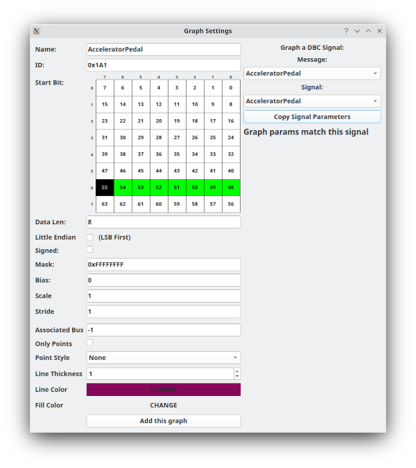

Graph Setup
============

Setting up a Graph
==================

This same screen is used whether you are creating a new graph or editing an existing graph. If you are creating a new graph then you have two options. 

Graphing a DBC Signal
=====================
If you want to graph a signal from a DBC file that you have loaded then pick the Message from the combo box. Picking a message will then allow you to pick a signal within that message. After selecting both the message and the signal then click the "Copy Signal Parameters" button. This will fill out the left hand side with the proper values for you automatically.

Manual Signal Graphing (Or Editing)
===================================

If you want to manually create a signal or edit an existing signal then you will find the relevant fields on the left hand size of the window.

"Name" is for your reference and will be shown on the Graphing Window.

"ID" is the frame ID to use for this graph. You can enter in either decimal or hex. Hex values are preceded by 0x

"Data Len" is used to specify how many bits are in the signal to graph. You can graph odd bit lengths such as 9, 11, or 15 bits. These are not as uncommon as you might think.

"Little Endian" switches between little and big endian mode. This will change how the signal grabs bits from the frame.

Once you've set both Data Len and Little Endian you can set the bits to use. The 8x8 grid above is used for this. Click on the start bit and the rest of the bits will automatically be selected for you based on Data Len and Little Endian. 

"Signed" can be used to select between signed and unsigned mode.

"Mask" will apply a mask to the value before using it.

"Bias" allows for setting an offset to the values to bring them to a different resting point

"Scale" is used as a multiplier to change the scaling of the values

"Stride" is not often used but will cause only every "x" values to actually be graphed. This can be used to graph a very dense set of data with less points to speed things up.

"Color" changes the color of the graphed line. It is automatically randomly set for new graphs but if you don't like the random color you can click the color and select a better one.

