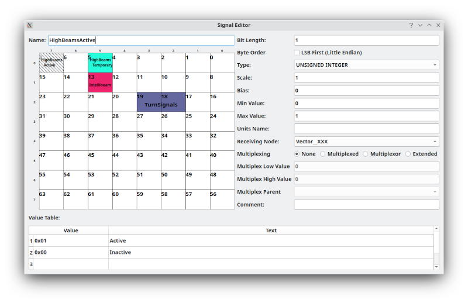

DBC Signal Editor
=================

Defining and Editing Signals
============================

If you're starting from scratch or otherwise adding a signal then you will need to right click in the list box in the upper left of the window. From there select "Add a New Signal." This will create a randomly named signal that you can then edit.

Otherwise, select a signal to edit. The details of it will fill out the rest of the window.

On the right side you can rename the signal and you'll see that it is renamed in the list as well. 

"Bit Length" - This sets how many bits the signal uses. Once you do this you'll see that that many bits are now highlighted in the 8x8 data grid above. The black bit is the "start" bit, green bits are the other bits in the signal. Gray bits are already used by another signal. You can still use them for the current signal too but doing so would be quite unusual. 

"Byte Order" - The way that the green bits are filled out is changed by this checkbox. Checking it selects little endian mode whereas deselecting chooses big endian mode. This will have an effect on any signal that crosses byte boundaries. 

"Type" can be:
1. UNSIGNED INTEGER - No sign bit, only positive numbers
2. SIGNED INTEGER - The top bit is used as a sign bit
3. SINGLE PRECISION - Floating point number (should be a 16 bit signal)
4. DOUBLE PRECISION - Floating point number (should be a 32 bit signal)
5. STRING - Directly turn the CAN bytes into a string

"Scale" is used to multiply the signal by the value to scale it appropriately

"Bias" is added to each value generated by the signal to set it at a different bias point

"Min Value" is purely informational. It is just a reference to anyone else viewing the DBC information as to what you expect the lowest value to be.

"Max Value" is likely informational.

"Units Name" is displayed after the value when you interpret a signal on the main frames list. For instance, you could set the units name to V so that a voltage value reads something like "12.34V" when it is displayed.

"Receiving Node" This is informational at the moment. You can set which node (out of all your defined nodes) is the one that receives this signal. 

"Multiplexing" This is a somewhat involved topic. DBC signals can be multiplexed which means that a given frame might have a range of data that is not always found in every frame. There is a key of sorts that specifies which piece of data this particular frame is sending. This leads to the concept of multiplexed signals and multiplexors. Multiplexors are the key. They provide a value that specifies which multiplexed data item is being sent. A multiplexed signal is then connected to a specific value of the multiplexor. Thus, a multiplexed signal requires that a multiplexor also exists. You would normally set all of this to "Not multiplexed" and skip all this complication. But, multiplexed signals do exist. In that case the message would have one multiplexor and one or more multiplexed signals. So, you'd set up a multiplexor for the message and then create additional multiplexed signals that are marked as "Multiplexed" and have filled out the "Multiplex Value" with something unique.

"Comment" is purely informational.

Signals that use either "UNSIGNED INTEGER" or "SIGNED INTEGER" as their type can define a Value Table. This table allows text strings to be substituted in place of integer values. For instance, if you know that a value of 0x10 means PARK then you can go to the next empty entry in the list, type 0x10 for the value and PARK for the Text. This will make the interpreted value read PARK any time the signal has a value of 0x10. This is used to make a more human friendly presentation. It should be noted that if the signal has a value not in the list then it will still be shown as it's integer value. But, known good values can be entered in the Value Table to make them easier to work with. 
