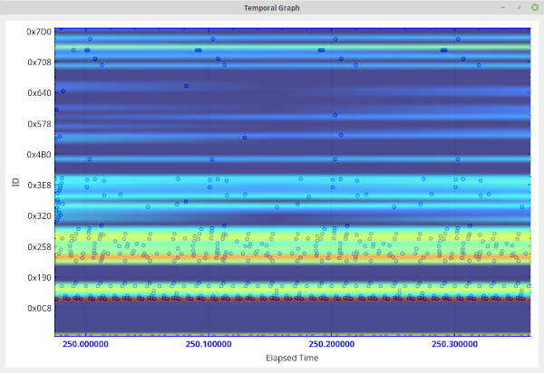

Temporal Window
=================

Using the Temporal Window
=========================

This window gives a dual graphical representation of CAN IDs over time. For each frame in the capture a circle is placed
on the graph at a point given by the time when the frame came in on the X axis and the frame ID on the Y axis. That is, a frame with ID 0x300
that comes in at 23.543 seconds would be plotted at the point 23.543, 0x300. The graph background is color coded for "density." That brings up
the question "What do you mean by density?" The answer is somewhat nebulous but essentially the color coded density maps where there is a lot of
traffic within a small space on the graph. This could be because many frames with the same ID came in rapid fire or it could be because many 
frames with similar IDs came in very close to each other - or both.

The general point of this window is to show how active the bus is at any given point in time and which IDs are most active (they'll create
bright streaks in the background color). There isn't a lot that can be done to modify the functionality of this window. All that can be done is 
zooming and panning the view. If you get the view too messed up the R key will reset the view back to standard. As with the Graphing Window, it is 
possible to select just the X or Y axis and zoom/pan that axis without affecting the other one. To do so, click on the axis marks of the axis you'd like
to independently control. To control both again click in the graph itself.
